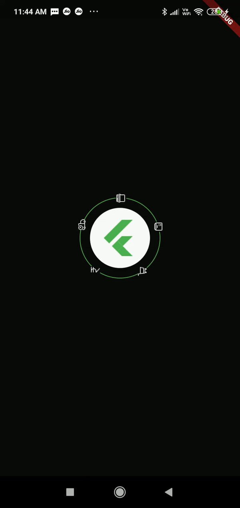
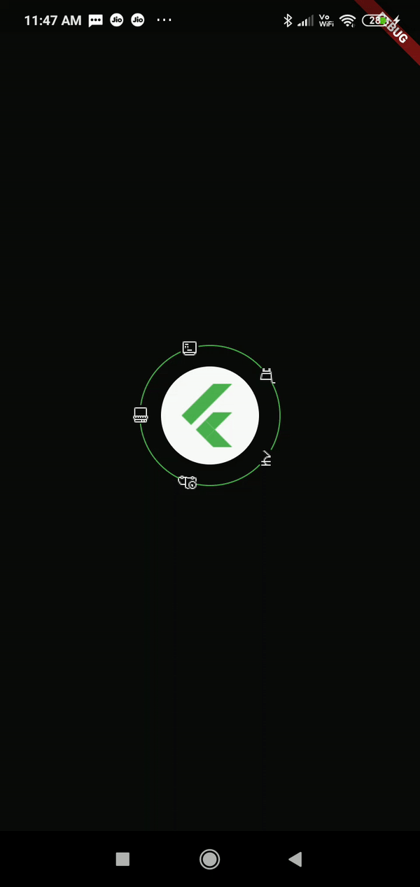

## Flutter SplashScreen - Ring Animation

## Preview

Heartbeat Ring Animation | Ring Animation
:---------------------------:|:---------------------------:
|![]https://github.com/sraodev/Flutter-SplashScreen-RingAnimation/blob/master/assets/screenshots/ring_animation.gif)

### SplashScreen - Heartbeat Ring Animation



### SplashScreen - Ring Animation



```dart
Center(
    child: WidgetRingAnimator(
      size: 120,
      ringIcons: const [
        'assets/store.png',
        'assets/product.png',
        'assets/cart.png',
        'assets/rupee.png',
        'assets/delivery.png',
      ],
      ringIconsSize: 3,
      ringIconsColor: Colors.grey[200],
      ringAnimation: Curves.linear,
      ringColor: Colors.green,
      reverse: false,
      ringAnimationInSeconds: 10,
      child: Container(
        child: Material(
          elevation: 8.0,
          shape: CircleBorder(),
          child: CircleAvatar(
            backgroundColor: Colors.transparent,
            child: Image.asset(
              'assets/app_logo.png',
              color: Colors.green,
              height: 65,
            ),
            radius: 45.0,
          ),
        ),
      ),
    )
),
```

Assets

- [icon8](https://icons8.com)

## Development Setup

Clone the repository and run the following commands:

```
flutter pub get
flutter run
```

## Contributing

Please feel free to fork, comment, critique, or submit a pull request.

## Author

P Srinivas Rao

## License

[MIT License](./LICENSE)


